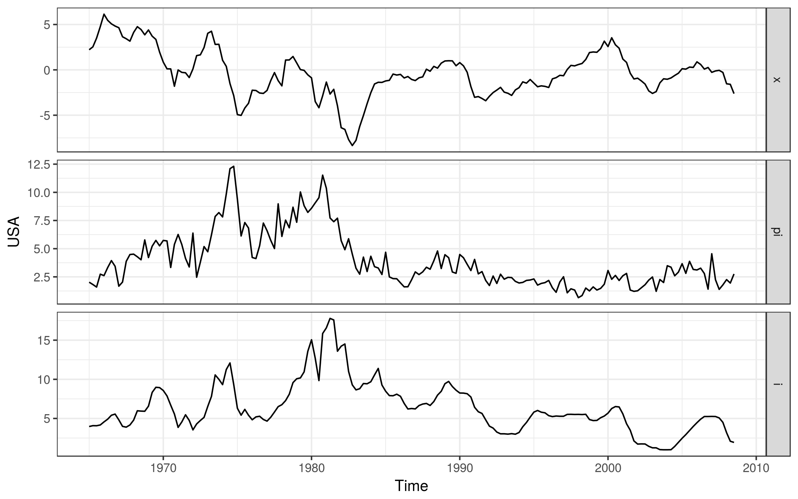
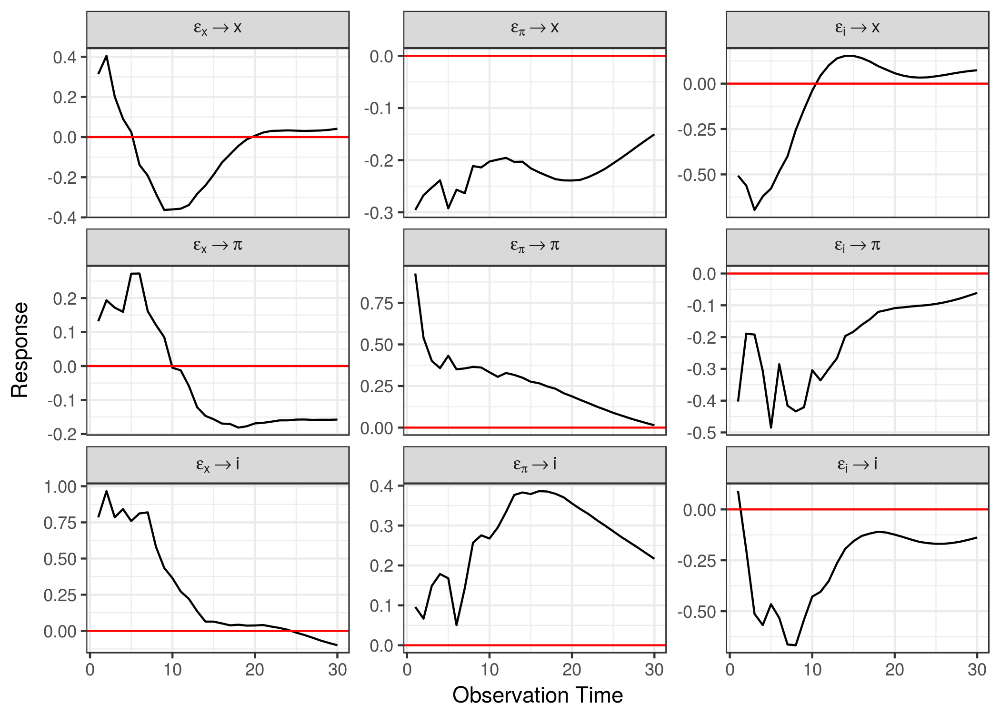

svars
=====

[](https://travis-ci.org/alexanderlange53/svars) 
[](https://cran.r-project.org/package=svars) 
[](https://cran.r-project.org/package=svars)

## Overview

svars contains data-driven identification methods for structural vector autoregressive (SVAR) models.
Based on an existing VAR model object (provided by e.g. VAR() from the 'vars' package), the structural impact relation matrix 
is obtained via data-driven identification techniques.

The cornerstone functions identify the structural errors

-   `id.cv()` by means of changes in volatility wit exogenous break.
-   `id.cvm()` via least dependent innovations based on Cramer-von Mises statistic.
-   `id.dc()` via least dependent innovations based on distance covariance matrix.
-   `id.ngml()` by means of non-Gaussian maximum likelihood.

These all return an estimated svars object with identified structural shocks and decomposed covariance matrix, for which the package contains varoius tools for further analysis.  


## Installation

```r
install.packages("svars")
```

Alternatively, install development version


```r
install.packages("devtools")
devtools::install_github("alexanderlange53/svars")
```


```r
library("svars")
```

## Usage

To get started, use the example data set which comes with the package. The data set consists of three U.S. macroeconomic time series, output gap (x), inflation (pi) and interest rates (r). For more details on the data set, please look into the description file `?USA`.

```r
ggplot2::autoplot(USA, facet = TRUE) + ggplot2::theme_bw()
```



The first step is to estimate a reduced form VAR, for instance with the vars package and store the resulting object. Afterwards, the user can choose a model from the svars package to estimate the structural VAR form. The choice of the model depends usually on the data structure, for more details look in the help file `help(svars)`. For illustration, we use the identification by means of non-Gaussian maximum likelihood. 

```r
reduced.form <- vars::VAR(USA, lag.max = 10, ic = "AIC" )
structural.form <- id.ngml(reduced.form)
summary(structural.form)

# Identification Results
# ---------------------- 
# 
# Method: Non-Gaussian maximum likelihood
# Sample size: 169
# Likelihood: -548.1502
# Stage3: FALSE
# Estimated degrees of freedom:                    4.643002 5.464837 2.889977
# Standard errors of estimated degrees of freedom: 1.675494 2.399747 0.7202668
# 
# Estimated B Matrix (unique decomposition of the covariance matrix): 
#             [,1]        [,2]      [,3]
# [1,]  0.50698223 -0.29546945 0.3133178
# [2,]  0.40274613  0.92602851 0.1318203
# [3,] -0.08952258  0.09603444 0.7849987
# 
# estimated standardized B matrix:
#            [,1]       [,2]      [,3]
# [1,]  1.0000000 -0.3190717 0.3991316
# [2,]  0.7943989  1.0000000 0.1679243
# [3,] -0.1765793  0.1037057 1.0000000
# 
# Standard errors of standardized B matrix:
#           [,1]       [,2]       [,3]
# [1,] 0.0000000 0.08662993 0.09808353
# [2,] 0.2616614 0.00000000 0.19118392
# [3,] 0.1264578 0.08121295 0.00000000
# 
# Estimated scale of the standardized B: 0.5069822 0.9260285 0.7849987
# Standard errors of the scale:          0.06375649 0.0969339 0.1801454
```
The summary provides some general informations regarding the estimation (see `?id.ngml`) and the decomposition of the covariance matrix, which is seen as the relation between reduced form errors and structural form errors. Furthermore, the resulting matrix represents the impact effects of structural shocks on the variables. Since the impact relation matrix is only identified up to sign and permutation, the user has to rearrange the columns according economic theory. For example, we order the columns according a specific sign pattern. Afterwards, we can calculate impulse response functions.

```r
structural.form$B <- structural.form$B[,c(3,2,1)]
structural.form$B[,3] <- structural.form$B[,3]*(-1)

impulse.response <- imrf(structural.form, horizon = 30)
plot(impulse.response, scales = 'free_y')
```

